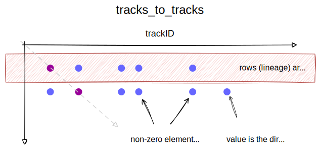
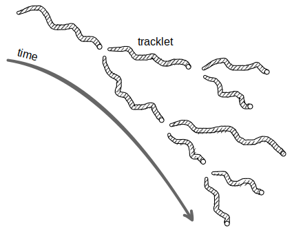
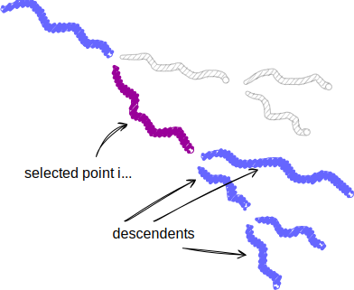
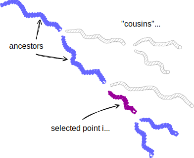

# File Format

Cell tracking data are loaded from a collection of [Zarr](https://zarr.dev) arrays. This allows
efficient access to data on static hosting, without the need for server-side processing. Necessary
queries are baked-in to the file format at the cost of some data redundancy.

These queries are encoded in sparse
[CSR-format](https://en.wikipedia.org/wiki/Sparse_matrix#Compressed_sparse_row_(CSR,_CRS_or_Yale_format))
arrays, represented by 2 or 3 Zarr arrays. Sparse arrays in CSR format allow relatively efficient
retrieval (typically 2 requests) of complete *rows* in the array. Conveniently, these Zarr arrays
can be constructed by saving the `indices` and `indptr` attributes (numpy arrays) of a
`scipy.sparse` array. The `data` array is only necessary if you have additional data to encode -
it's used in the `tracks_to_points` where it stores the point coordinates. If present, the `data`
array should have shape `(len(indices), N)`, where `N` is the number of associated pieces of data
(in the `tracks_to_points` example, this is 3).

Here is the directory layout including approximate sizes for the arrays our example dataset. Note
the relatively small size of the `indptr` arrays, providing an opportunity for efficient caching and
reducing the total number of requests when fetching tracks.

```
ZSNS001_tracks_bundle.zarr (~550M)
├── points (198M)
├── points_to_tracks (62M)
│   ├── indices (61M)
│   └── indptr (1M)
├── tracks_to_points (259M)
│   ├── data (207M)
│   ├── indices (50M)
│   └── indptr (2M)
└── tracks_to_tracks (28M)
    ├── data (19M)
    ├── indices (7M)
    └── indptr (2M)
```

Arrays are stored as chunked zarr arrays. Chunk sizes should be optimized for your specific data.

A [conversion script](#conversion-script) is provided to generate this zarr bundle arrays from a CSV
file.


## points

The `points` array is a dense, ragged array of 32-bit floats with shape `(n_timepoints,
3 * max_points_per_timepoint)`. So each row is a timepoint, and within that row are point coordinates as
`[x0, y0, z0, x1, y1, z1, ...]`. Rows with fewer points are padded at the end with `-9999.9`. Each
point is then given a unique ID calculated by `t * max_points_per_timepoint + n` where `t` is the
timepoint (row in the `points` array), and `n` is the index of the point within the timepoint. That
is, the point ID is just a flat index value into the ragged array.

This array is used for fetching all the points in a given timeframe.

## points_to_tracks

The `points_to_tracks` array encodes the relationship between a given point ID (row) and any track
IDs (columns) it is part of. The total shape of the array is then `(n_points, n_tracks)`. Thus,
fetching a row is used to get all tracks associated with a given point. This is effectively an
adjacency matrix. In the sample data, each point belongs to at most one track. Values in the array
don't matter, just the presence of a nonzero element which indicates a connection. This is becasue
the data we're interested in (the track ID) is encoded by the column index.

This is the first query run when points are selected.

## tracks_to_tracks

This array, shape `(n_tracks, n_tracks)` allows us to retrieve lineage (ancestors and descendents)
for a given track. Each row is a track, and the columns are the tracks it is connected to. How
this is computed will determine the lineage returned when selecting data. See the section on [lineage
computation](#lineage-computation) in the included conversion script for more details on how it is
currently computed.

The *presence* of a nonzero element in this graph represents a connection between two tracks
(adjacency matrix). The *value* of each nonzero element encodes the direct parent track id for the
corresponding column.

<p align="center">
  
  <p align="center">
    <em>Figure 1 - structure of the</em> tracks_to_tracks <em>matrix. Diagonal elements are always
    present, meaning a track is always part of its own lineage. The value of each sparse element is
    the</em> parent_track_id <em>(or -1) for the track indicated by that column.</em>
  </p>
</p>

This is run for each track returned from the initial `points_to_tracks` query.

## tracks_to_points

This is just a transpose of the `points_to_tracks` array, but it also contains the point locations.
This redundancy is an optimization so each point location does not have to be re-fetched from the
`points` array.

This is the *last* query run when points are selected, and is run for each track in the lineage.

# Conversion script
A script (`convert_tracks_csv_to_sparse_zarr.py`) is provided to generate these arrays from a CSV
file. The CSV file should be generated using Ultrack or a similar tracking software. To use this
script, columns in the CSV file should be ordered as follows:
- track_id - unique identifier for the track this point belongs to
- t - timepoint
- z, y, x - 3D coordinates
- parent_track_id - reference to the parent track, if any (-1 otherwise)

The script requires numpy, scipy, and zarr libraries. This script is not optimized, and takes about
4 minutes to convert the example dataset on an Apple M1 Pro.

## Lineage computation
Most of the logic in the script is pretty straightforward, but the lineage computation may require
some explanation.

The lineage we're after for a given tracklet is all of its ancestors and descendents. The goal is to
encode this in a single row of the `tracks_to_tracks` array. This means the lineage we fetch depends
on which tracklet in the lineage corresponds to the selected point. *Figure 2* shows two examples to
illustrate this. To load the *complete* lineage for a given tracklet, find its oldest ancestor
tracklet and select any point in it.

<p align="center">
  
  <br>
  
  
  <p align="center">
    <em>Figure 2 - lineage depends on which point is selected. (top) a cartoon depecting a group of
    related tracklets. (left) selecting points at earlier timepoints will load more descendent
    tracks. (right) selecting points at later timepoints will load all ancestors, but fewer
    descendents.</em>
  </p>
</p>

To do this, we need to pre-compute something like the [transitive
closure](https://en.wikipedia.org/wiki/Transitive_closure) of the directed graph of track
connections. The *complete* transitive closure would produce a graph where each cluster is a
fully-connected graph of all the tracks in a lineage. Instead we start by first creating adjacency
matrices for two *un*directed graphs: `tracks_to_children` and `tracks_to_parents`. Iterative
squaring of these matrices converges on the transitive closure of each - this gives each tracklet a
connection to all of its descendents (`tracks_to_children`) or all of its ancestors
(`tracks_to_parents`).

The sum of these matrices produces the directed adjacency matrix we want, where a track is connected
directly to all of its ancestors and descendents. Values in this matrix are overwritten by parent
track IDs. This allows efficient lineage retrieval form a CSR matrix by fetching a single row.

The iterative squaring algorithm is not very efficient, but it's simple and works for the sizes of
data we're dealing with. For larger datasets or more complex lineage (e.g. full lineage including
"cousins"), a more efficient algorithm (Floyd–Warshall) may be necessary.
